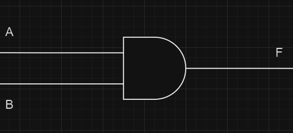
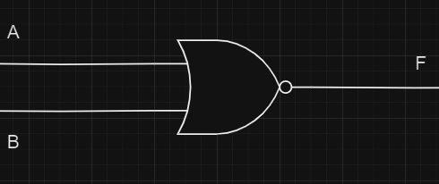
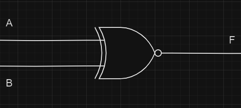
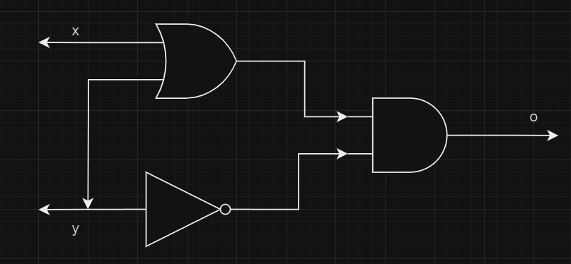

- Logic gates: ``NOT, AND, OR, XOR, NAND, NOR``
- The images were drawn using [draw.io]()
### NOT


| A | F |
| ---- | ---- |
| 0 | 1 |
| 1 | 0 |
- In ``Verilog`` using structural modelling (by calling a primitive):
	- ``not(F, A);``
- In ``Verilog`` using data-flow modelling:
	- ``assign F = ~A;``


### AND



| A | B | F |
| ---- | ---- | ---- |
| 0 | 0 | 0 |
| 0 | 1 | 0 |
| 1 | 0 | 0 |
| 1 | 1 | 1 |
- In ``Verilog`` using structural modelling (by calling a primitive):
	- ``and(F, A, B);``
- In ``Verilog`` using data-flow modelling:
	- ``assign F = A & B;``


### OR


| A | B | F |
| ---- | ---- | ---- |
| 0 | 0 | 0 |
| 0 | 1 | 1 |
| 1 | 0 | 1 |
| 1 | 1 | 1 |
- In ``Verilog`` using structural modelling (by calling a primitive):
	- ``or(F, A, B);``
- In ``Verilog`` using data-flow modelling:
	- ``assign F = A | B;``

### XOR (exclusive OR)


| A | B | F |
| ---- | ---- | ---- |
| 0 | 0 | 0 |
| 0 | 1 | 1 |
| 1 | 0 | 1 |
| 1 | 1 | 0 |
- In ``Verilog`` using structural modelling (by calling a primitive):
	- ``xor(F, A, B);``
- In ``Verilog`` using data-flow modelling:
	- ``assign F = A ^ B;``

### NAND (not AND)


| A | B | F |
| ---- | ---- | ---- |
| 0 | 0 | 1 |
| 0 | 1 | 1 |
| 1 | 0 | 1 |
| 1 | 1 | 0 |
- In ``Verilog`` using structural modelling (by calling a primitive):
	- ``nand(F, A, B);``
- In ``Verilog`` using data-flow modelling:
	- ``assign F = ~(A & B);``


### NOR (not OR)



| A | B | F |
| ---- | ---- | ---- |
| 0 | 0 | 1 |
| 0 | 1 | 0 |
| 1 | 0 | 0 |
| 1 | 1 | 0 |
- In ``Verilog`` using structural modelling (by calling a primitive):
	- ``nor(F, A, B);``
- In ``Verilog`` using data-flow modelling:
	- ``assign F = ~(A | B);``

### NXOR/XNOR (not XOR)



| A | B | F |
| ---- | ---- | ---- |
| 0 | 0 | 1 |
| 0 | 1 | 0 |
| 1 | 0 | 0 |
| 1 | 1 | 1 |
- In ``Verilog`` using structural modelling (by calling a primitive):
	- ``xnor(F, A, B);``
- In ``Verilog`` using data-flow modelling:
	- ``assign F = ~(A ^ B);``	
-----------------------------------------------------------------

- In the ``Verilog`` programming language instructions are executed in parallel. The only block that makes and exception to this rule is the ``always`` block.

- Assignment operations:
	- ``assign``: when the right-hand value changes, it triggers the left-hand value to change as well
	- ``<=`` (less than or equal to): is a non-blocking operation that executes at ``POSEDGE CLK`` (when the CPU clock is at the top of the wave)
	- ``=`` : is a blocking operation
	
## Exercise 1 - Majority Voter with 2 inputs
- Replicate and simulate the following circuit in ``Verilog``


- ``ex1.v``
```Verilog
module ex1(output o, input x, input y);
	//porti logice
	wire r1, r2;
	assign r1 = x|y;
	assign r2 = ~y;

	assign o = r1&r2;
endmodule

```

- ``ex1_tb.v``
```Verilog

module ex1_tb;
	reg x, y;
	wire o;

	ex1 uut(.o(o), .x(x), .y(y));
	initial begin
		x = 0;
		y = 0;
		#100;
	end

	always begin
		#25 x=~x;
		#50 y=~y;
	end
endmodule

```

- Exercise 2 - Replicate and simulate the following ``Majority-Voter`` circuit (with 3 inputs):
	- A ``Majority-Voter`` circuit evaluates to true when **half or more** inputs are true.
- 