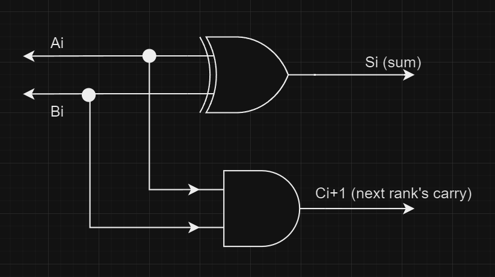
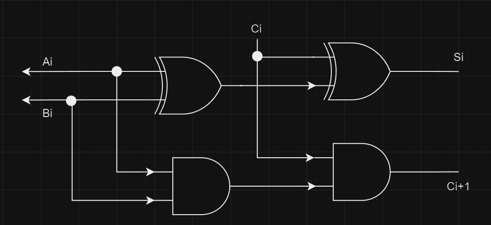

- Scope:
	- writing functions as a sum of products
	- optimization using Boolean Algebra
- - The images were drawn using [draw.io]() with 210% zoom
### Boolean Algebra Axioms:
- For the set ``B``  and operators ``+``, ``*``, where the set ``B`` only has two elements ``{0,1}``,  ``+`` is equivalent to the logical ``OR``, and ``*`` is equivalent to the logical ``AND`` 

1. The set ``B`` is closed on the ``+``, and ``*`` operators. This means that applying the operators on the set, the result will still be an element from the set.
2. Identity/Neutral element: 
	- ``a + 0 = a`` 
	- ``a * 1 = a``
3. Commutative property:
	- ``a + b = b + a``
	- ``a * b = b * a``
4. Distributive property:
	- ``a + (b * c) = (a + b) * (a + c)``
	- ``a * (b + c) = (a * b) + (a * c)``
5. The Complement (where ``a'`` is the equivalent of logical ``NOT a``):
	- ``a + a' = 1``
	- ``a * a' = 0``
6. The set ``B`` has at least two elements.

### Theorems
1. ``x + x = x`` -- ``x * x = x``
2. ``x + 1 = 1`` -- ``x * 0 = 0``
3. ``y * x + x = x`` -- ``(y + x) * x = x``
4. ``(x')' = x``
5. ``(x + y) * z = x + (y + z)`` -- ``(x * y) * z = x * (y * z)``
6. (De Morgan) ``(x + y)' = x' * y'`` -- ``(x * y)' = x' + y'``

### Simplification Theorems
1. ``xy + xy' = x(y + y') = x``, where ``xy = x * y``
2. ``(x + y)(x + y') = xx + xy' + xy + yy' = x + x + 0 = x``
3. ``x(x + y) = x``
4. ``x + x'y = x + y``
5. ``x(x' + y) = xy``

## Converting a truth table to a function
- For more complex circuits, it's harder to break it into logic gates, so we create a function directly from the truth table.

- For the following truth table:

| a   | b   | c   | F   |
| --- | --- | --- | --- |
| 0   | 0   | 0   | 0   |
| 0   | 0   | 1   | 0   |
| 0   | 1   | 0   | 0   |
| 0   | 1   | 1   | 1   |
| 1   | 0   | 0   | 1   |
| 1   | 0   | 1   | 1   |
| 1   | 1   | 0   | 1   |
| 1   | 1   | 1   | 1   |


- We are only interested in the places where the result (``F``) is ``true (1)``:
	- when ``a`` is ``0``, ``b`` is ``1``, and c is ``1``
	- when ``a`` is ``1``, ``b`` is ``0``, and c is ``0``
	-  when ``a`` is ``1``, ``b`` is ``0``, and c is ``1``
	-  when ``a`` is ``1``, ``b`` is ``1``, and c is ``0``
	-  when ``a`` is ``1``, ``b`` is ``1``, and c is ``1``
	
- ``F = a'bc + ab'c' + ab'c + abc' + abc`` = sum of logical products
	- We now simplify the obtained function by using the common factor between products:
		- ``F = a'bc + ab'(c' + c) + ab(c' + c)``, where ``c' + c = 1``
		- ``F = a'bc + ab' + ab``
		- ``F = a'bc + a(b' + b)``
		- ``F = a'bc + a = a + bc``, by using the 4th simplification theorem

## Half-Adder Circuit



- Half-Adder truth table:

| Ai  | Bi  | Si  | Ci+1 |
| --- | --- | --- | ---- |
| 0   | 0   | 0   | 0    |
| 0   | 1   | 1   | 0    |
| 1   | 0   | 1   | 0    |
| 1   | 1   | 0   | 1    |
- ``F(Ci+1) = AiBi``
- ``F(Si) = AiBi' + Ai'Bi = XOR(Ai, Bi)``

- ``halfadder.v``
```Verilog
module halfadder(output si, output ci1, input ai, input bi);
	assign si = ai ^ bi;
	assign ci1 = ai & bi;
endmodule
```

- ``halfadder_tb.v``
```Verilog
module halfadder_tb;
	reg ai;
	reg bi;
	
	wire si;
	wire ci1;
	
	halfadder uut(
		.ai(ai),
		.bi(bi),
		.si(si),
		.ci1(ci1)
	);

	initial begin
		ai = 0;
		bi = 0;
		#100;
	end

	always begin
		#25 ai = ~ai;
		#50 bi = ~bi;
	end
endmodule

```


## Full-Adder Circuit



| Ai  | Bi  | Ci  | Si  | Ci+1 |
| --- | --- | --- | --- | ---- |
| 0   | 0   | 0   | 0   | 0    |
| 0   | 0   | 1   | 1   | 0    |
| 0   | 1   | 0   | 1   | 0    |
| 0   | 1   | 1   | 0   | 1    |
| 1   | 0   | 0   | 1   | 0    |
| 1   | 1   | 0   | 0   | 1    |
| 1   | 0   | 1   | 0   | 1    |
| 1   | 1   | 1   | 1   | 1    |
- ``F(Si) = Ai'Bi'Ci + Ai'BiCi' + AiBi'Ci' + AiBiCi = Ai'(Bi'Ci + BiCi') + Ai(Bi'Ci' + BiCi)``
	- where ``(Bi'Ci + BiCi') = XOR(Bi, Ci)``, and ``(Bi'Ci' + BiCi) = NOT XOR(Bi, Ci)``
- ``F(Ci+1) = Ai'BiCi + AiBiCi' + AiBi'Ci + AiBiCi = Bi(Ai'Ci + AiCi') + AiCi(Bi' + Bi)``
	- ``F = Bi(Ai'Ci + AiCi') + AiCi``, because ``(Bi' + Bi) = 1``
		- where ``(Ai'Ci + AiCi') = XOR(Ai, Ci)``
		
- ``fulladder.v``
```Verilog
module fulladder(output si, output ci1, input ai, input bi, input ci);
	assign si = (~ai&(bi^ci))|(ai&~(bi^ci));
	assign ci1 = (bi&(ai^ci))|(ai&ci);
endmodule
```

- ``fulladder_tb.v``
```Verilog
module fulladder_tb;
	reg ai;
	reg bi;
	reg ci;
	
	wire si;
	wire ci1;
	
	fulladder uut(
		.ai(ai),
		.bi(bi),
		.ci(ci),
		.si(si),
		.ci1(ci1)
	);

	initial begin
		ai = 0;
		bi = 0;
		ci = 0;
		#100;
	end

	always begin
		#25 ai = ~ai;
		#50 bi = ~bi;
		#75 ci = ~ci;
	end
endmodule

```